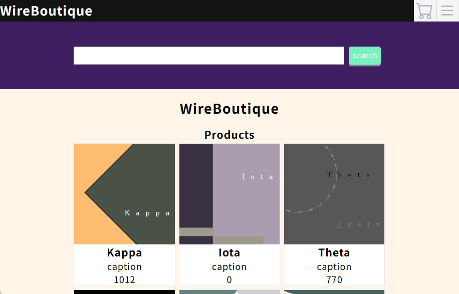
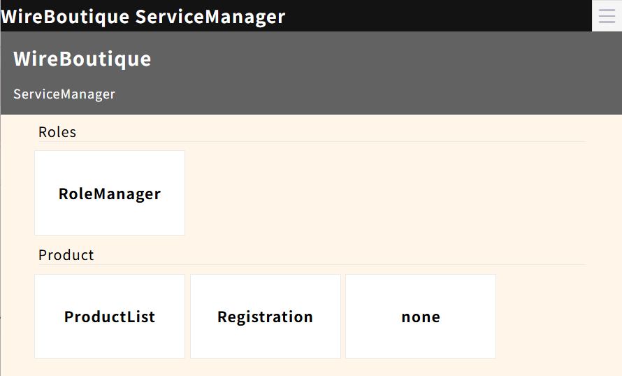
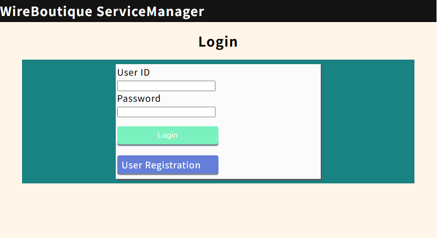
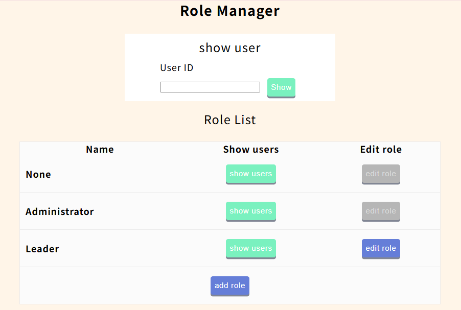
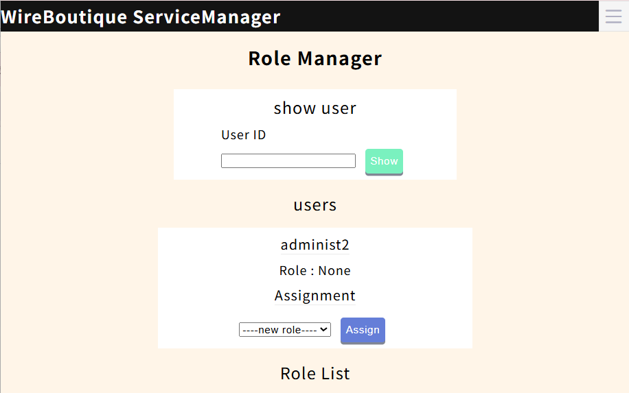
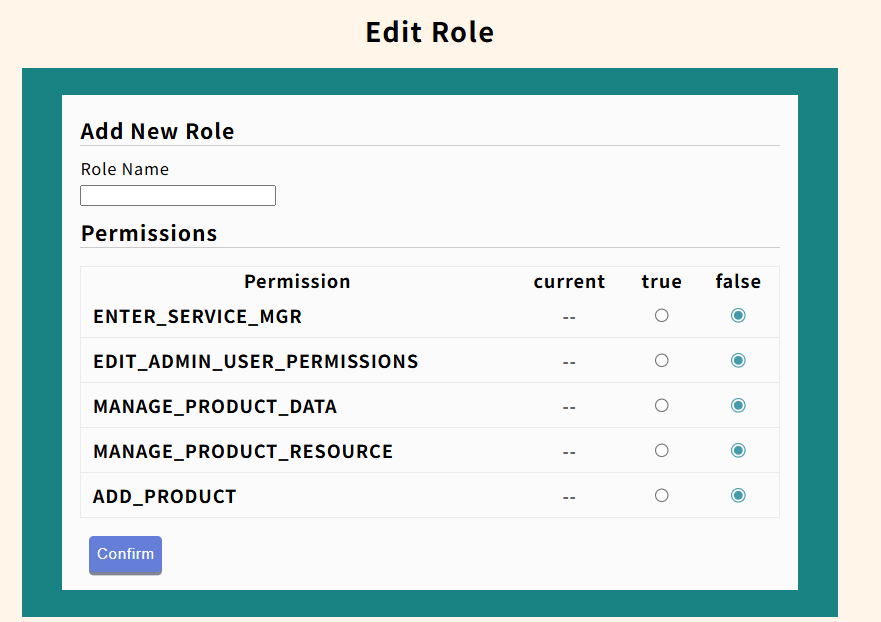
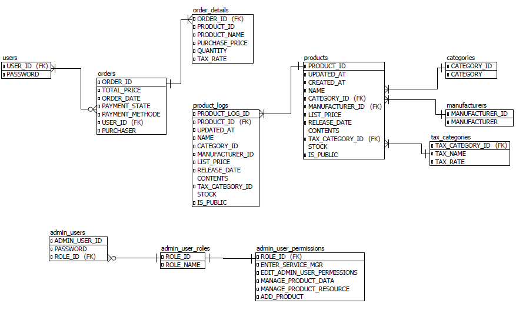

# WireBoutique - ソフトウェア、デジタルデータのダウンロードストア

ECサイト(オンラインショップ)を模したポートフォリオ  

公開URL:  
  - ECサイト: 公開終了
  - 管理ページログインフォーム: 公開終了

管理ページについては　[管理ページ - ServiceManagerについて](#管理ページ---servicemanagerについて)をご参照下さい。

## 概要
ソフトウェアや音声ファイル等のデジタルデータの販売を想定しゼロから構築した独自のECサイトです。サービスの管理ページを持ち、商品の販売から運用までを完結できることが特徴です。

## 機能
### ECサイト
  - ホーム画面へ商品検索できるボタンを表示
  - ホーム画面へ商品を新しい順に8件表示
  - 商品名及び商品IDから検索できる検索機能
  - カート機能
  - 購入する際に使用するユーザーの新規登録・ログイン機能

### 管理ページ
  - 新規商品の登録
  - 商品情報、公開設定の管理
  - 操作できる機能を決定する「ロール」を持つ管理ページ専用ユーザー
  - 管理ページ専用ユーザーの新規登録・ログイン機能
  - 管理ページ専用ユーザーのロール変更機能
  - ロールの新規追加・編集機能

## 管理ページ - ServiceManagerについて
管理ページへのアクセスは専用ユーザーへのログインをすることで行います。  
専用ユーザーは「ロール」というステータスを持ちます。これは各操作に対する権限のセットです。  
新規ユーザーは「None」のロールを持ちます。これを別のロールへ変更しアクセスを許可することにより、管理ページへのアクセスが可能になります。  
特殊なロールとして「Administrator」が存在します。これを持つユーザーは全ての操作を許可されます。

### アクセス手順
ユーザー情報がある場合:
  1. ログインページへアクセス
  2. ログインページよりユーザーID、パスワードを入力しログイン

新規登録する場合 (クリックで展開)

  
  1. ログインページへアクセス、UserRagistrationボタンをクリック
  2. ユーザーID、パスワードを入力しRagistrationボタンをクリック
  3. ロールがAdministratorであるユーザーにてログインしRoleManagerをクリック
  4. ロール一覧からNoneの列にあるshow usersをクリック

  5. 表示されたユーザー一覧から登録したユーザー下のプルダウンよりENTER_SERVICE_MGRがtrueであるロールを選択、Assignをクリック
      - ENTER_SERVICE_MGRがtrueであるかはロール一覧のEdit Roleで確認できる
      - 目的のロールが存在しない場合ロール一覧下部のAdd Roleからロールを追加できる

  

ロール追加/編集画面  

  6. ログインページよりユーザーID、パスワードを入力しログイン

## 使用技術
### フロントエンド
  - HTML / CSS
  - JSP
### バックエンド
  - JAVA 21
  - Servlet 6.0
  - MySQL 9.3.0
### インフラ
  - AWS(EC2, ALB)
  - Apache 2.4.63
  - Apache Tomcat 11
  - Docker/Docker-compose

## AWS構成図

## ER図

## 今後の課題と展望
### ECサイト
  - 課題
    - 説明文や画像等の商品情報の拡充
    - 商品購入後のダウンロードページの実装
    - ユーザーページの追加、購入履歴の表示
  - 展望
    - カテゴリー・メーカー別での商品検索、表示
    - 支払い機能の外部サービス導入
### 管理ページ
  - 課題
    - 在庫管理専用の機能の追加
    - カテゴリー及びメーカーの登録・編集をできる機能の追加
  - 展望
    - 在庫管理専用の機能
    - サービス全体での注文情報の管理機能
